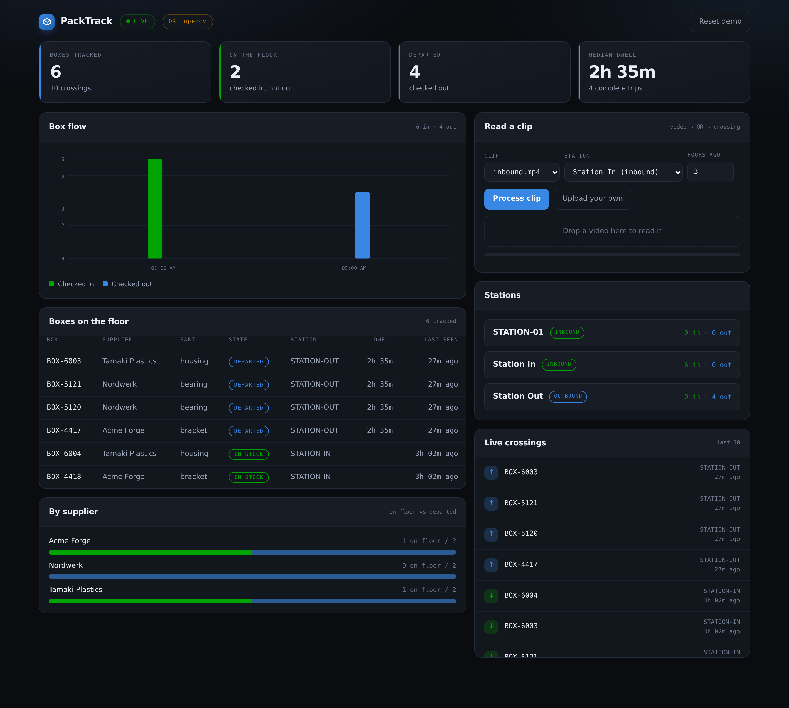

# PackTrack

Track returnable boxes through a factory from camera footage. A QR label passes
a station, PackTrack reads it, decides whether the box arrived or left, and the
dashboard shows what is on the floor, what has gone, and how long things stay.



## Run the demo

```bash
python -m venv .venv && . .venv/bin/activate
pip install -r requirements.txt

python tools/make_demo_video.py     # renders demo footage with known box ids
python api.py                       # serves the API and the dashboard on :8000
python tools/seed_demo.py           # reads both clips, in another terminal
```

Then open <http://localhost:8000>.

`tools/seed_demo.py` clears everything and replays both clips, so the demo can
be reset between runs. The dashboard also reads a clip on its own: pick one,
pick a station, press **Process clip**, or drop a video file onto the panel.

## How a scan becomes a crossing

A QR read says only "this box was visible here". It does not say whether the
box was arriving or leaving, so **the station supplies that**:

| Station role | What a scan there means |
| --- | --- |
| `inbound` | the box is checked **in** |
| `outbound` | the box is checked **out** |
| `both` | one camera doing both jobs: each scan flips the box |

Dwell time is the gap between a box's check-in and its check-out.

The other half of the job is that a camera sees the same label in many
consecutive frames. One box carried past a lens is **one** crossing, not thirty,
so a repeat of the same box in the same direction inside a cooldown window is
treated as the same physical event. On the demo clips that turns 62 label reads
into 6 arrivals.

## What is where

```
decoder.py    QR decoding, pyzbar when available, OpenCV otherwise
tracking.py   the check-in / check-out rule and the repeat filter
video.py      read a clip, decode its labels, record the crossings
jobs.py       background processing so the page can show progress
db.py         boxes, stations, suppliers, and the append-only event log
api.py        HTTP API and the dashboard page
web/          the dashboard: one HTML file and one JS file, no build step
tools/        demo footage, printable labels, demo seeding
```

## Two QR gotchas worth knowing

Both of these were found by things silently not scanning, which is the worst way
for a demo to fail.

**Micro QR does not work with the OpenCV backend.** Several QR libraries,
segno included, quietly pick a *Micro* QR for short payloads — and OpenCV's
detector cannot read Micro QR at all. A label holding just `BOX-9` prints
perfectly and then never scans. Always force a standard symbol: `segno.make_qr()`,
not `segno.make()`. `tools/make_test_qr.py` does this, and decodes what it wrote
before telling you it succeeded.

**The OpenCV decoder has blind spots.** It misses the occasional standard symbol
outright — not at a bad angle or a small size, but always, while its own
single-symbol call reads the same image. `decoder.py` tries both for that
reason. For anything beyond a demo, install pyzbar, which reads more
symbologies and is far more reliable:

```bash
brew install zbar          # macOS
sudo apt install libzbar0  # Debian/Ubuntu
pip install pyzbar
```

The dashboard header shows which backend is live, so a missed label never
quietly looks like a missing box.

## API

| Endpoint | Purpose |
| --- | --- |
| `POST /api/scan` | record one sighting; the station's role sets the direction |
| `POST /api/video/upload` | process an uploaded clip in the background |
| `POST /api/video/demo` | process a bundled demo clip |
| `GET /api/jobs/{id}` | progress and result of a processing job |
| `GET /api/events` | the crossing log |
| `GET /api/boxes` | boxes, with state and dwell |
| `GET /api/stations` | stations and their roles |
| `PATCH /api/stations/{id}` | change a station's role |
| `GET /api/dashboard` | everything the page draws |
| `POST /api/demo/reset` | clear boxes and crossings |

Interactive docs at `/docs`.

## Tests

```bash
pip install -r requirements-dev.txt
pytest -q          # 38 tests
ruff check .
```

No camera or network needed. The video tests run against the generated demo
clips and skip cleanly if they have not been rendered.

## Limitations

- **Detection is label-driven.** A box with no readable QR in view is not
  tracked. `detector.py` wraps YOLO for bounding boxes, but the pipeline works
  on label reads alone and the shipped class ids are COCO placeholders.
- **Live camera capture is untested here.** `pipeline.py` streams from a USB or
  RTSP source, but this prototype has only been exercised against video files.
- **Jobs are in-process.** Restarting the server loses running work; the
  database survives.
- **The demo clips are synthetic.** Real footage brings motion blur, angles and
  glare that these do not.
